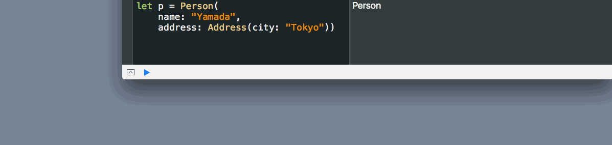
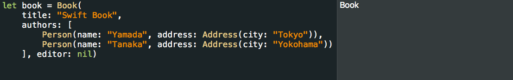

[](https://travis-ci.org/safx/Lensy)
[](https://codecov.io/github/safx/Lensy?branch=master)

# Lensy

Simple Lens for Swift

## Example

Here is an example `struct`s:

```swift
struct Person {
    let name: String
    let address: Address
}

struct Address {
    let city: String
}
```

You have to create lenses you want to use first.

```swift
let name = Lens<Person, String>(
    g: { $0.name },
    s: { (this, newValue) in Person(name: newValue, address: this.address) }
)
let address = Lens<Person, Address>(
    g: { $0.address },
    s: { (this, newValue) in Person(name: this.name, address: newValue) }
)
let city = Lens<Address, String>(
    g: { $0.city },
    s: { (this, newValue) in Address(city: newValue) }
)
```

You can use the lenses you've defined as follows:

```swift
let p = Person(name: "Yamada",
               address: Address(city: "Tokyo"))

name.get(p)                               // OK("Yamada")
name.set(p, "Suzuki")                     // OK(Person(name:"Suzuki", address: Address(city: "Tokyo"))

let composed = address.compose(city)
composed.get(p)                           // OK("Tokyo")
composed.set(p, "Osaka")                  // OK(Person(name:"Yamada", address: Address(city: "Osaka"))
composed.modify(p) { $0.uppercaseString } // OK(Person(name:"Yamada", address: Address(city: "TOKYO"))
```

## ArrayIndexLens, OptionalUnwrapLens

Lensy can access elements of arrays by using `ArrayIndexLens` and unwrap optionals by `OptionalUnwrapLens`.

```swift
struct Book {
    let title: String
    let authors: [Person]
    let editor: Person?
}

let authors = Lens<Book, [Person]>(
    g: { $0.authors },
    s: { (this, newValue) in Book(title: this.title, authors: newValue, editor: this.editor) }
)

let editor = Lens<Book, Person?>(
    g: { $0.editor },
    s: { (this, newValue) in Book(title: this.title, authors: this.authors, editor: newValue) }
)


let book = Book(
    title: "Swift Book",
    authors: [
        Person(name: "Yamada", address: Address(city: "Tokyo")),
        Person(name: "Tanaka", address: Address(city: "Yokohama"))
    ],
    editor: Person(name: "Sasaki", address: Address(city: "Sapporo")))

authors.compose(ArrayIndexLens<Person>(at: 0)).compose(name).get(book)     // OK("Yamada")
authors.compose(ArrayIndexLens<Person>(at: 1)).compose(composed).get(book) // OK("Yokohama")
editor.compose(OptionalUnwrapLens<Person>()).compose(name).get(book)       // OK("Sasaki")
```

Lensy returns `Error` when outside of an array is accessed.

```swift
authors.compose(ArrayIndexLens<Person>(at: 2)).compose(composed).get(book) // Error(ArrayIndexOutOfBounds)
```

# LensHelper

You can generate some lenses and lens helper classes by using [swift-idl](https://github.com/safx/swift-idl).

After code generation, you can use lenses defined in the inner struct `Lenses`:

```swift
Book.Lenses.authors
    .compose(ArrayIndexLens<Person>(at: 0))
    .compose(Person.Lenses.address)
    .compose(Address.Lenses.city)
    .get(book)
```

Or you can use `LensHelper` through `$`:

```swift
Book.$.authors[0].address.city.get(book)
```

You can use code completion in Xcode when you use `LensHelper`.



You can use `[]` in LensHelper to access an element of array.


